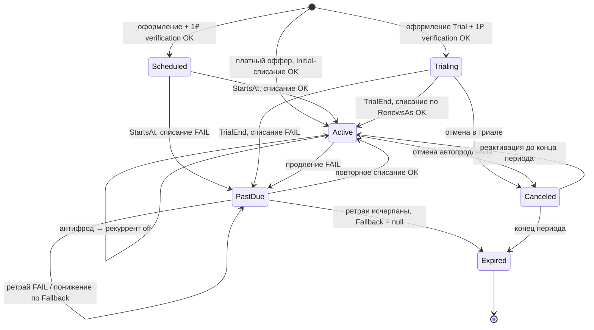

# Модуль Subscriptions — Машина состояний `UserSubscription`

> **Версия:** 1.0
> **Статус:** Accepted
> **Последнее изменение:** 2026-06-28
> **Этап дорожной карты:** 3 (Подписки и монетизация)
> **Связанные документы:** `domain-model.md`, [[02_Архитектура]], [[12_Безопасность]], `../../policies/POL-004-subscription-access.md`, `../../adr/ADR-0017-recurring-payments-yookassa.md`

Документ описывает жизненный цикл подписки пользователя: состояния, переходы, их триггеры и побочные эффекты, включая проверочное списание, антифрод и публикацию интеграционных событий смены роли.

---

## Содержание

1. [Состояния](#1-состояния)
2. [Источники триггеров](#2-источники-триггеров)
3. [Проверочное списание 1 ₽ и привязка рекуррента](#3-проверочное-списание-1-и-привязка-рекуррента)
4. [Антифрод и отключение рекуррента](#4-антифрод-и-отключение-рекуррента)
5. [Диаграмма состояний](#5-диаграмма-состояний)
6. [Таблица переходов](#6-таблица-переходов)
7. [Понижение по Fallback](#7-понижение-по-fallback)
8. [Публикация событий и смена роли](#8-публикация-событий-и-смена-роли)
9. [Влияние на доменную модель](#9-влияние-на-доменную-модель)
10. [Открытые вопросы](#10-открытые-вопросы)
11. [История изменений](#11-история-изменений)

---

## 1. Состояния

| Состояние | Смысл | Доступ к грантам |
|-----------|-------|:----------------:|
| `Scheduled` | Создана, начнёт действовать в будущем (`StartsAt` впереди) | Нет |
| `Trialing` | Активный пробный период; списаний по тарифу нет до `TrialEnd` | Да |
| `Active` | Оплачена и действует | Да |
| `PastDue` | Очередное списание не прошло, идут ретраи (грейс-период) | Да |
| `Canceled` | Автопродление отменено пользователем; доживает до конца периода | Да, до `CurrentPeriodEnd` |
| `Expired` | Период закончился без продления; рекуррент отключён | Нет |

Статус `Paused` (заморозка) **сознательно не предусмотрен** — в рамках текущей версии не требуется.

---

## 2. Источники триггеров

Переходы инициируются из **двух** источников, и это важно для архитектуры списаний:

1. **Фоновая задача (scheduler)** — по достижении `NextBillingAt` инициирует списание у платёжного шлюза и создаёт `SubscriptionPayment(Pending)`. Сама статус не двигает.
2. **Webhook от шлюза** — асинхронно сообщает результат списания (`Succeeded`/`Failed`). Именно он двигает статус.

Поэтому на стрелках «списание OK / FAIL» — это реакция на webhook, а не синхронный код в момент продления.

**Идемпотентность.** Webhook может прийти повторно. Обработчик сначала проверяет `SubscriptionPayment.GatewayTransactionId` (UNIQUE): если платёж уже обработан — переход не выполняется повторно (no-op).

**Безопасность.** Эндпоинт webhook не авторизуется JWT (его дёргает шлюз). Подлинность проверяется по IP-диапазонам ЮKassa плюс **перезапросом реального статуса** через `GET /payments/{id}` — тело уведомления доверенным не считается. Опционально добавляется signing secret из кабинета (Developers → Webhooks). Эндпоинт обязан быстро вернуть HTTP 200, иначе ЮKassa повторяет доставку (до 7 раз за 24 часа), а тяжёлую обработку выносить в фон.

**Исходящая идемпотентность.** При инициации автоплатежа сборщик передаёт заголовок `Idempotence-Key`, построенный детерминированно от `(SubscriptionId + период)`, — повторный суточный прогон по той же подписке не приведёт к двойному списанию. Это отдельный механизм от входящей идемпотентности (UNIQUE `GatewayTransactionId`).

**Одностадийность.** Автоплатежи создаются с `capture: true`, чтобы платёж шёл сразу в `succeeded`, минуя промежуточный `waiting_for_capture`.

---

## 3. Проверочное списание 1 ₽ и привязка рекуррента

Чтобы оформить рекуррентные платежи, нужна привязка способа оплаты (recurring-токен) у шлюза. Для платного оффера привязка возникает при первом реальном списании. Но у `Trial` (бесплатно) и `Scheduled` (списание в будущем) реального списания на оформлении нет — поэтому для них делается **обязательное проверочное списание 1 ₽**:

- При оформлении создаётся `SubscriptionPayment(Purpose = Verification, Amount = 1)`.
- При `Succeeded` — сохраняется recurring-токен (`GatewayPaymentMethodId`), а возврат 1 ₽ инициируется **синхронно** в этом же обработчике (`POST /refunds`); завершение придёт своим webhook `refund.succeeded` и обработается идемпотентно.
- Только после успешной верификации подписка входит в `Trialing` / `Scheduled`.
- При `Failed` верификации — оформление отклоняется, подписка в машину состояний не входит.

Для платного оффера (`Standard`/`Intro`) отдельное проверочное списание не нужно: его роль выполняет первое реальное списание (`Purpose = Initial`), оно же создаёт привязку. Альтернатива 1 ₽ — привязка на нулевую сумму (без денежного движения, возвращать нечего); выбор способа скрыт за `IPaymentGateway`.

**Важно: проверочное списание ≠ юридическое согласие.** 1 ₽ (или привязка на ноль) лишь добывает токен у шлюза. Согласие на рекуррент образуют оферта с раскрытыми условиями + явный акт согласия на форме + 3-D Secure + механизм отписки. Термы фиксируются в `SubscriptionAgreement` (якорь `AcceptedAt`), полный контекст акта — событием в бизнес-лог. Подробнее — доменная модель, раздел `SubscriptionAgreement`.

---

## 4. Антифрод и отключение рекуррента

Антифрод — **по правилам шлюза**, собственную систему не строим. Ключевое: не каждый `Failed` — это фрод. Обработчик ветвит отказ по `cancellation_details.reason` ЮKassa:

- **бизнес-отказ** (недостаточно средств, лимит) → обычная неудача → dunning-ретраи по лестнице (`PastDue`);
- **фрод-причина** (подозрение на мошенничество, блокировка) → немедленно `AutoRenew = false`, `RecurringDisabledReason = Antifraud`, **без ретраев**.

При срабатывании фрод-ветки:

- Если на **проверочном** списании (`Trial`/`Scheduled`) — привязка не сохраняется, оформление отклоняется.
- Если у **действующей** подписки — текущий оплаченный период сохраняется (доступ не отзывается мгновенно), но автопродления не будет: по окончании периода подписка уйдёт в `Expired`.
- Помеченное фродом списание при необходимости возвращается (`Refunded`).

Антифрод не вводит отдельного состояния — он действует как сквозной guard, гасящий рекуррент. Для тяжёлых случаев возможна немедленная отмена (на усмотрение политики, вне текущей версии).

---

## 5. Диаграмма состояний

---

## 6. Таблица переходов

| Переход | Триггер | Условие (guard) | Побочные эффекты |
|---|---|---|---|
| `→ Scheduled` | Оформление отложенной подписки (retention) | 1 ₽ verification `Succeeded`, антифрод не сработал | Сохранён `GatewayPaymentMethodId`; 1 ₽ `Refunded`; оферта `Initial` |
| `→ Trialing` | Оформление оффера `Kind = Trial` | 1 ₽ verification `Succeeded`, антифрод не сработал | Сохранён токен; 1 ₽ `Refunded`; оферта `Initial`; **`SubscriptionActivated`** (доступ начинается) |
| `→ Active` (первичный) | Оформление платного оффера | `Initial`-списание `Succeeded`, антифрод не сработал | Снепшот цены; токен привязки; оферта `Initial`; **`SubscriptionActivated`** |
| ⊘ оформление отклонено | verification/Initial `Failed` **или** антифрод | — | Подписка не создаётся (или помечается отклонённой); токен не сохраняется |
| `Scheduled → Active` | webhook `Succeeded` на `StartsAt` | — | Снепшот цены; **`SubscriptionActivated`** |
| `Trialing → Active` | webhook `Succeeded` на `TrialEnd` | списание по `RenewsAs`-офферу прошло | `CurrentPriceId ← RenewsAs`; снепшот новой цены |
| `Active → Active` | webhook `Succeeded` на `CurrentPeriodEnd` | `AutoRenew = true` | Новый период; если `RenewsAs` меняет сумму — снепшот + оферта `PriceChange` |
| `Active → PastDue` | webhook `Failed` на продлении | `reason` = бизнес-отказ (не фрод) | `FailedAttempts = 1`; запланировать ретрай по `RetryIntervalsHours[0]` |
| `PastDue → PastDue` (ретрай) | webhook `Failed` на ретрае | `FailedAttempts < Max` | `FailedAttempts++`; запланировать следующий ретрай |
| `PastDue → PastDue` (понижение) | `FailedAttempts >= Max` | `FallbackPriceId != null` | `CurrentPriceId ← Fallback`; `FailedAttempts = 0`; снепшот + оферта `Downgrade`; **`SubscriptionDowngraded`**; попытка списать по новой цене |
| `PastDue → Active` | webhook `Succeeded` (ретрай или после понижения) | — | `FailedAttempts = 0`; доступ восстановлен |
| `PastDue → Expired` | `FailedAttempts >= Max` | `FallbackPriceId == null` | `AutoRenew = false`; `RecurringDisabledReason = AttemptsExhausted`; `EndedAt`; **`SubscriptionExpired`** |
| `Active/Trialing → Canceled` | Пользователь отменяет автопродление | — | `CancelAtPeriodEnd = true`; `AutoRenew = false`; `CanceledAt`; доступ до конца периода |
| `Canceled → Active` | Пользователь реактивирует | до `CurrentPeriodEnd` | `CancelAtPeriodEnd = false`; `AutoRenew = true` |
| `Canceled → Expired` | Достигнут `CurrentPeriodEnd` (фоновая задача) | — | `EndedAt`; **`SubscriptionExpired`** |
| (любое активное) → рекуррент off | webhook `Failed` с фрод-причиной (`cancellation_details.reason`) | `reason` = фрод | `AutoRenew = false`; `RecurringDisabledReason = Antifraud`; без ретраев; статус не меняется (период доживает) |

---

## 7. Понижение по Fallback

Понижение **не вводит отдельного состояния**. Подписка остаётся `PastDue`, но у неё меняется `CurrentPriceId` на удешевлённый оффер, счётчик сбрасывается, и цикл ретраев начинается заново на новой ступени — это петля `PastDue → PastDue`. Выходы из неё:

- успешное списание по дешёвой цене → `Active` (**гранты сохраняются** — удешевлённый оффер указывает на тот же план);
- у удешевлённого оффера `Fallback = null` и ретраи исчерпаны → `Expired`.

Лестница «5000 → 599 → 299 → стоп» — это несколько проходов этой петли с разными `CurrentPriceId`.

---

## 8. Публикация событий и смена роли

Интеграционные события публикуются после коммита транзакции через RabbitMQ.

| Событие | Когда | Подписчик |
|---------|-------|-----------|
| `SubscriptionActivated` (`EVT-SUB-001`) | Первый вход в состояние с доступом (`Trialing`/`Active`) из состояния без доступа | Users |
| `SubscriptionExpired` (`EVT-SUB-002`) | Вход в `Expired` | Users |
| `SubscriptionDowngraded` (`EVT-SUB-003`) | Понижение по `Fallback` | Notifications |
| `SubscriptionPriceChangeScheduled` (`EVT-SUB-004`) | Запланировано повышение цены на продлении | Notifications |

### 8.1. Нюанс смены роли

Важно: **роль ≠ гранты.** Роль — это покупочный порог (право купить Base-план), а гранты выдаёт подписка. Доступ к гранту в рантайме регулирует отдельный **гейт усвоения** (`грант → RequiredRole?`, см. доменную модель 4.2).

- **Повышение роли:** на сами действующие подписки не влияет. Роль лишь открывает возможность *купить* Base-план более высокого уровня. До покупки нового плана полный функционал не появляется (шеф со Стандартом получает гранты Стандарта).
- **Карательное понижение роли** (только за нарушения правил): подписка **не отменяется**, возврат **не делается**, продление **не блокируется**. Роль-привязанные гранты (продвижение/реклама) автоматически гаснут через гейт усвоения в резолвере; потребительские гранты и сама подписка работают дальше. eligibility по `RequiredRole` на продлении **не перепроверяется**.

Смена роли **не порождает перехода в машине состояний** — это целиком решается резолвером грантов. UC-SUB-208 (`RoleChanged`) при понижении лишь логирует/уведомляет, но подписку не гасит.

- **`SubscriptionExpired` и отзыв роли:** обработчик в Users перед отзывом роли проверяет, нет ли у пользователя **другой** активной Base-подписки, дающей ту же роль (мульти-слот: несколько подписок).
- **Отмена сама по себе** (`Active → Canceled`) событий смены роли **не** порождает — роль отзывается только при фактическом истечении (`Canceled → Expired`).
- Переходы `PastDue` роль **не** трогают — в грейс-период доступ сохраняется; публикуется только `SubscriptionDowngraded` (Notifications).
- Событие `SubscriptionActivated`/`Expired` эмитит **только Base**-подписка; AddOn роль не меняют.

---

## 9. Влияние на доменную модель

Требования этого документа учтены в `domain-model.md`. Сводка для справки:

**Новый enum `PaymentPurpose`** (назначение платежа, поле `SubscriptionPayment.Purpose`):

| Значение | Назначение |
|----------|-----------|
| `Verification = 0` | Проверочное списание (1 ₽) для привязки рекуррента; возвращается |
| `Initial = 1` | Первое реальное списание при оформлении платного оффера |
| `Recurring = 2` | Рекуррентное списание при продлении (в т.ч. по удешевлённому офферу) |

**Новый enum `RecurringDisabledReason`** (причина отключения рекуррента, поле `UserSubscription.RecurringDisabledReason`, nullable):

| Значение | Назначение |
|----------|-----------|
| `Antifraud = 0` | Отключён антифрод-проверкой |
| `AttemptsExhausted = 1` | Исчерпаны ретраи без успешного списания |
| `UserCanceled = 2` | Отменён пользователем |

**Новые поля `UserSubscription`:**

| Поле | Тип | Null | Назначение |
|------|-----|:----:|-----------|
| `GatewayPaymentMethodId` | `string` | да | Токен привязки способа оплаты у шлюза для рекуррента |
| `RecurringDisabledReason` | `int` | да | Причина отключения рекуррента (enum выше); `null` пока рекуррент активен |

**Новое поле `SubscriptionPayment`:**

| Поле | Тип | Null | Назначение |
|------|-----|:----:|-----------|
| `Purpose` | `int` | нет | `PaymentPurpose`: назначение списания |

---

## 10. Открытые вопросы

1. **Возврат 1 ₽** — синхронно при том же webhook или отдельной операцией возврата? (влияет на обработчик)
2. **Антифрод** — внешний сервис/правила шлюза или собственный набор правил? (влияет на архитектуру списаний)
3. **Реактивация из `Expired`** — не предусмотрена как переход (только из `Canceled`). Истёкшую подписку оформляем заново как новую. Подтвердить.

Далее по плану — **архитектура рекуррентных списаний** зафиксирована в `../../adr/ADR-0017-recurring-payments-yookassa.md`: суточный сборщик против webhook-обработчика, `IPaymentGateway`, идемпотентность и reconciliation.

---

## 11. История изменений

| Версия | Дата | Изменение |
|--------|------|-----------|
| 1.0 | 2026-06-28 | Перенос в `docs/public/modules/subscriptions/subscription-state-machine.md` как первой публичной версии (содержание соответствует приватному черновику v1.3: 6 состояний без `Paused`, проверочное списание 1 ₽, верификация webhook по IP + перезапрос статуса, исходящая идемпотентность `Idempotence-Key`, антифрод по `cancellation_details.reason`, синхронный возврат 1 ₽, мульти-слот — роль эмитит только Base, карательное понижение без отмены и возврата). |
